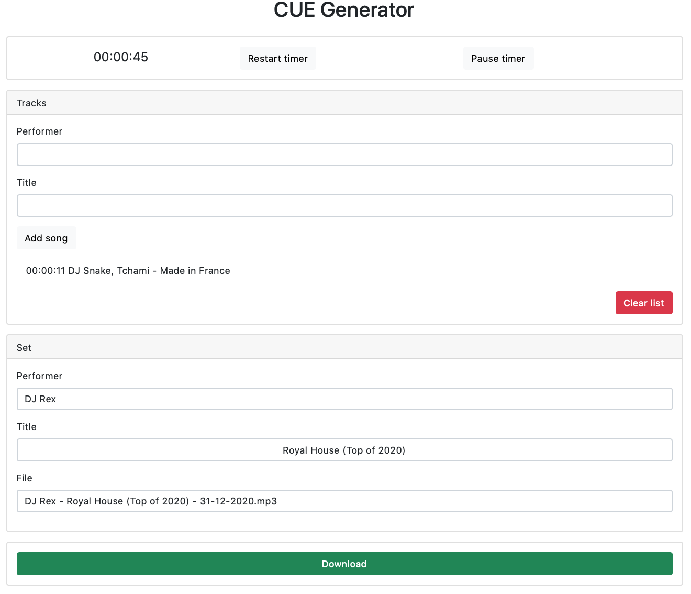

# CUE Generator

## How to use

- Start the timer, when you start your set
- Enter track performer and track title and press [Add Song]
- You will see your added songs appear in the list
- When you are ready with your set, enter performer, title and filename for the set
- Click download to download your .cue file

A .cue file is a simple text file. If you make any mistake, you can edit the downloaded file with a simple text editor.

## Screenshot

